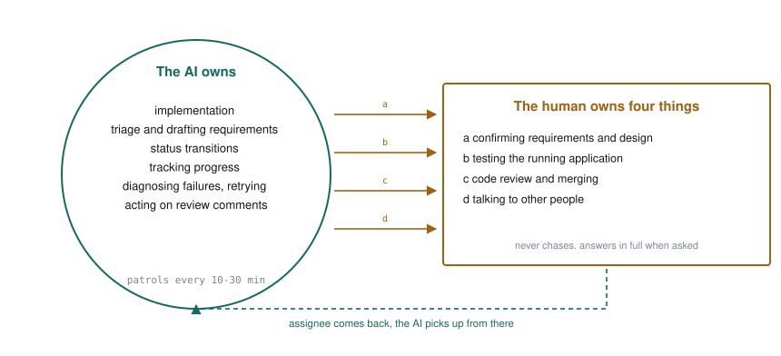
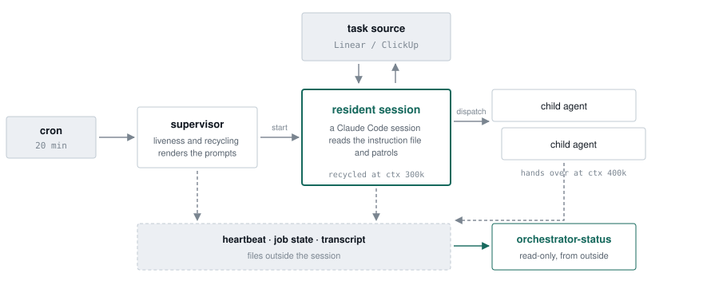

# claude-task-orchestrator

*English · [日本語](README.md)*

**The AI drives the work. It hands off to a human for four things only.**

Implementation, triage and progress tracking are the AI's job. It is not waiting to be told what to
do. When the work reaches something only a person can do, it moves the assignee and stops there.

A resident [Claude Code](https://claude.com/claude-code) session patrols a single task source
(Linear or ClickUp) and dispatches child agents to do the work.

**→ [Design notes](https://nisioka.github.io/claude-task-orchestrator/en/)**

## Division of labour

A human owns four things.

| | The human owns | What the AI does instead |
|---|---|---|
| **(a)** | Confirming requirements and design | Drafts the requirements and a proposal first, then hands over |
| **(b)** | Testing the running application | Never claims to have looked at a screen |
| **(c)** | Code review and merging | Opens the PR and stops. Never presses the button |
| **(d)** | Talking to other people | Never lets its own words be read as the human's |

**Everything else is the AI's.** Implementation, triage, status transitions, tracking progress,
diagnosing failures and retrying, acting on review comments.

<picture>
  <source media="(prefers-color-scheme: dark)" srcset="docs/img/duties-en-dark.svg">
  
</picture>

The only mechanism for handing off is **changing the assignee**. The status stays where it is.

## What it optimises for

**The human's waiting time, not the AI's throughput.**

Those two often point in opposite directions. Starting four more implementations while three items
already sit waiting for review does not make the system faster. It only grows the pile the human has
to get through. Handing over less, and getting what you handed over back sooner, works better.

The human is the bottleneck. That is the premise. But the AI **never chases**. Instead it earns the
right to stay quiet by being able to answer "where are we?" completely, the moment it is asked. That
is why `orchestrator-status` reports **by duty** rather than by count.

```
■ Your ball (11)
  Confirm requirements (3)   …
  Review and merge (4)       …
  Check whether the wait cleared (4) …
```

## How a hand-off works

**Ownership is decided by the assignee and nothing else. Status is never used to decide it.** If the
assignee is the AI, the task is the AI's whatever its status. So a human hands work back the same
way: change the assignee, leave the status alone.

The human's queue is readable by duty:

| Status | What the human is being asked for |
|---|---|
| `Question` | Confirm requirements (a) |
| `Test` | Test the running application (b) |
| `In Review` | Review and merge (c) |
| `Wait` | The AI is stuck and needs a hand, or something external has to arrive |

**The status is left alone because it records how far the work got.** A run that dies at PR creation
still finished the implementation. Rolling it back to `Todo` erases that. The reason goes in a
comment *before* the assignee changes — the assignee change is the signal that reaches the human, so
the reason has to already be there when they open it.

**The AI is never allowed to conclude "this status can't be mine".** The only statuses excluded are
`Backlog` and the terminal ones, and that list is a **denylist**, not an allowlist.

> An allowlist of "statuses the AI may hold" once hid every `Test` issue assigned to the AI from the
> status view. The AI could not read the instructions waiting in the comments, read the situation as
> impossible, and kept handing the issue back. **Forgetting an entry in an allowlist hides work.
> Forgetting one in a denylist only leaves it on the list.**

## What keeps the autonomy running

Autonomy does not survive on good judgement alone. It fails by **stopping without anyone noticing**.
That is the whole job of the TypeScript side.

| | | |
|---|---|---|
| **01** | Keep the session alive | Checks every 20 minutes. Recycles a perfectly healthy session once its context hits the ceiling |
| **02** | Hand it tools | Reading and writing the task source, notifications, sorting a rebase, reaping verification containers |
| **03** | Read the state from outside | Answers even when the AI is down. You want it most when things are broken, so it never goes through the AI |

<picture>
  <source media="(prefers-color-scheme: dark)" srcset="docs/img/runtime-en-dark.svg">
  
</picture>

The failure mode that matters for a resident process is not death but **a session that stalls**. A
session whose context has degraded still answers; it just stops patrolling. The process is still
there, so a liveness check reports "healthy" forever.

```
healthy ≝ the session is listed, is not in a terminal state, and its heartbeat is recent
```

**A session is recycled on context size even when its patrols are fine.** The cost of a turn is set
by how much context it is carrying, and context never shrinks. The longer a session lives, the more
it pays for the same work.

| | |
|---|---|
| **85%** | Share of eight days of spend that went on re-reading context |
| **6%** | Share that went on output over the same period |
| **300k** | Default context ceiling for recycling the resident session |
| **400k** | Default context ceiling for making a child hand over |

That is why the trigger is context and not elapsed time. The age limit exists **only as a fallback
for when context could not be measured**.

## Why prose

"Do I ask a person about this, or decide it myself?" does not reduce to a state machine. So the
judgement and the control flow live in [prompts/orchestrator.md](prompts/orchestrator.md), in prose.

> A child goes `blocked` when it is waiting on a human decision. **This state does not change with
> time.** The child just keeps waiting inside its session, invisible to the human. Unless you hand it
> over, it stays stopped and nobody finds out.

That is not documentation of the control flow. It *is* the control flow. Changing the behaviour means
rewriting the paragraph.

## Requirements

- [Claude Code](https://claude.com/claude-code) running locally
- Node.js 20 or newer
- A task source: a Linear or ClickUp workspace, plus **one account for the AI**

## Usage

```bash
npm install
cp .env.example .env    # edit it

# See where things stand (read-only; answers even if the orchestrator is broken)
npx tsx src/index.ts orchestrator-status

# Check the resident session and start it if needed (run from cron every 20 min)
npx tsx src/index.ts orchestrator-supervisor

# Reap verification containers
npx tsx src/index.ts container-sweep --dry-run
```

CLIs that read and write tasks directly live in `src/cli/`:

```bash
npx tsx src/cli/personal-issues.ts
npx tsx src/cli/personal-issue-detail.ts <ISSUE-ID> --comments=40
npx tsx src/cli/personal-status.ts --id=<ISSUE-ID> --status="In Review"
npx tsx src/cli/personal-assignee.ts --id=<ISSUE-ID> --to=human
npx tsx src/cli/send-reminder.ts "message"
```

## Configuration

| File | What it holds |
|---|---|
| `.env` | API keys and where to notify ([.env.example](.env.example)) |
| `~/.config/ai-orchestrator/repositories.json` | The repositories to work on ([docs/repositories.md](docs/repositories.md)) |
| `~/.config/ai-orchestrator/workflow.json` | Status names ([docs/workflow.md](docs/workflow.md); defaults apply if absent) |

- [docs/task-source.md](docs/task-source.md) — switching between Linear and ClickUp, and what each gets wrong
- [docs/orchestrator-crontab.md](docs/orchestrator-crontab.md) — the cron entries, and how an edited instruction file takes effect

## Embedding it

Take it as a submodule and combine it with jobs of your own. The core knows nothing about the
repository that embeds it.

```bash
# Prompt sources are layered; later wins
ORCHESTRATOR_PROMPT_SOURCE_DIRS=core/prompts,prompts
ORCHESTRATOR_REPO_DIR=/path/to/your-repo
```

| Slot | What you can add |
|---|---|
| `{{childRules}}` | Builds the table of child kinds from each source's `child/rules.json` |
| `{{extraSections}}` | Appends your own sections to the end of the instruction file |
| `{{coreDir}}` / `{{repoDir}}` | Points at the core's CLIs and at your repository's scripts separately |
| `TaskProvider` | A ten-method interface, with Linear and ClickUp implementations included |

Status names come from configuration too. Whatever you put in `workflow.json` is substituted into the
prompts at render time, so a workspace that calls `Test` `deploy & test` reads correctly without
touching the prose.

See [docs/embedding.md](docs/embedding.md).

## Development

```bash
npm test
npx tsc --noEmit
```

The tests are polluted by your own `.env`. Reproduce what CI sees with
`DOTENV_CONFIG_PATH=/nonexistent/.env npx vitest run src`.
