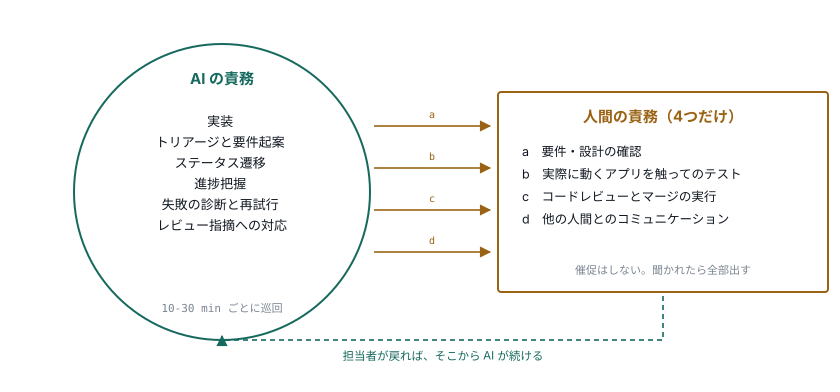
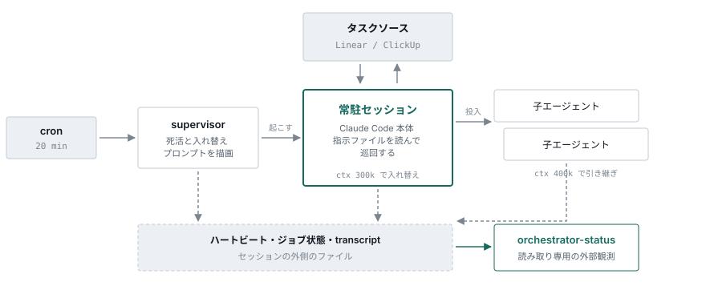

# claude-task-orchestrator

*[English](README.en.md) · 日本語*

**AI が主体でタスクを回し、人間にしかできない4つの用事にだけ委譲する。**

実装もトリアージも進行管理も AI の責務です。人間に「これをやっておいて」と頼まれるのを待つ立場では
ありません。人間にしかできないところに来たときだけ、担当者を渡して止まります。

常駐した [Claude Code](https://claude.com/claude-code) のセッションが、単一のタスクソース
（Linear / ClickUp）を巡回し、子エージェントを立てて仕事を進めます。

**→ [設計の解説ページ](https://nisioka.github.io/claude-task-orchestrator/)**

## 分担

人間が担うのは次の4種だけです。

| | 人間の責務 | AI 側の振る舞い |
|---|---|---|
| **(a)** | 要件・設計の確認 | 要件と設計案を起案してから渡す |
| **(b)** | 実際に動くアプリを触ってのテストとフィードバック | 画面を見たとは言わない |
| **(c)** | コードレビューとマージの実行 | PR を作るところまで。ボタンは押さない |
| **(d)** | 他の人間とのコミュニケーション | AI の発言が人間の発言として受け取られる状況を作らない |

**それ以外は全て AI の責務です。** 実装、トリアージ、ステータス遷移、進捗把握、失敗の診断と再試行、
レビュー指摘への対応。

<picture>
  <source media="(prefers-color-scheme: dark)" srcset="docs/img/duties-dark.svg">
  
</picture>

委譲の手段は**担当者の変更だけ**です。ステータスは動かしません。

## 最適化するもの

**人間の待ち時間を最小にすることです。AI の処理量を最大にすることではありません。**

この2つはしばしば逆を向きます。人間の確認待ちが3件たまっているときに新しい実装を4件走らせても、
系全体の進みは速くなりません。人間が確認しなければならない量が増えるだけです。人間に渡すものを減らし、
渡したものが早く返ってくる状態を保つほうが効きます。

人間はボトルネックになります。それを前提に組んであります。ただし**催促はしません**。代わりに、
人間が「今どうなってる？」と聞いたときに即座に網羅的に答えられることで埋め合わせます。
`orchestrator-status` が件数ではなく**責務別**に答えるのはこのためです。

```
■ あなたのボール (11件)
  要件確認 (3件)      …
  レビューとマージ (4件) …
  待ちの解除確認 (4件)  …
```

## 委譲のしかた

**所有権は担当者だけで決まります。ステータスは判定に使いません。** 担当者が AI なら、ステータスが
何であっても AI の仕事です。だから人間も、ステータスを動かさずに担当者だけを変えて仕事を戻します。

人間のボールは、ステータスから責務が読めます。

| ステータス | 人間が何を求められているか |
|---|---|
| `Question` | 要件確認 (a) |
| `Test` | 実機テスト (b) |
| `In Review` | レビューとマージ (c) |
| `Wait` | AI が詰まって介入を待っている、または外部要因待ち |

**ステータスを動かさないのは、それがどこまで進んだかの記録だからです。** PR 作成で落ちても実装
フェーズは終わっています。`Todo` へ巻き戻すと、その情報が消えます。渡すときは**理由を先にコメント
してから**担当者を変えます。担当者の変更が人間に届く合図なので、開いた時点で理由が載っている必要が
あります。

**「このステータスを AI が持つはずがない」という判断はさせません。** 除外するのは `Backlog` と
終了系だけで、それは許可リストではなく**除外リスト**です。

> かつて「AI が持ってよいステータス」の許可リストで絞っていたため、`Test` ＋担当者 = AI のイシューが
> 状態表示から消えました。AI はコメントに書かれた指示を読めないまま、「存在しない状態」と解釈して
> 人間へ差し戻し続けました。許可リストは書き漏らすと**隠れます**。除外リストは書き漏らしても
> **一覧に残る**だけです。

## 自律が続くための足場

自律は「賢く判断すること」だけでは保ちません。**止まったことに誰も気づかない**、という壊れ方を
するからです。TypeScript 側の担当はここだけです。

| | | |
|---|---|---|
| **01** | セッションを起こし続ける | 20分ごとに死活を見る。文脈が上限に達したら健全でも入れ替える |
| **02** | 道具を渡す | タスクソースの読み書き、通知、rebase の仕分け、検証用コンテナの回収 |
| **03** | 外から状態を読む | AI が倒れていても答える。壊れているときにこそ知りたいので AI を経由しない |

<picture>
  <source media="(prefers-color-scheme: dark)" srcset="docs/img/runtime-dark.svg">
  
</picture>

状態表示がセッションに問い合わせないのは、**知りたいのが壊れているときだから**です。

常駐型に固有かつ最も起きやすい故障は、プロセスの死ではなく**セッションの停滞**です。文脈が劣化した
セッションは応答しますが巡回を止めます。プロセスは存在し続けるため、存在確認だけの監視は永久に
「健全」と報告します。

```
健全 ≝ セッションが一覧に存在し、かつ終端状態でなく、かつハートビートが新しい
```

**セッションは巡回が正常でも、文脈が上限に達したら入れ替えます。** 1ターンの費用は抱えている文脈の
大きさで決まり、文脈は減りません。長く生きたセッションほど、同じ仕事に高い単価を払います。

| | |
|---|---|
| **85%** | 8日間の支出のうち、文脈の読み直しが占めた割合 |
| **6%** | 同じ期間で、出力が占めた割合 |
| **300k** | 常駐セッションを入れ替える文脈量の既定 |
| **400k** | 子に引き継ぎを書かせる文脈量の既定 |

入れ替えの基準が時間ではなく文脈量なのはこのためです。稼働時間の上限は、**文脈を測れなかったときの
保険**にすぎません。

## なぜ散文なのか

「これは人間に聞くべきか、自分で決めてよいか」は状態機械に落ちません。だから判断と制御フローは
[prompts/orchestrator.md](prompts/orchestrator.md) の散文で書かれています。

> 子が `blocked` になるのは、人間の判断を待っているときです。**この状態は時間では変わりません。**
> 子はセッションの中で待ち続けるだけで、人間からは見えません。あなたが渡さない限り、誰も気づかない
> まま止まり続けます。

これは仕様書ではなく、実行される制御フローそのものです。挙動を変えるときは、この文章を書き直します。

## 前提

- [Claude Code](https://claude.com/claude-code) がローカルで動くこと
- Node.js 20 以上
- タスクソース: Linear もしくは ClickUp のワークスペースと、**AI 用のアカウント1つ**

## 使い方

```bash
npm install
cp .env.example .env    # 編集する

# 状況を見る（読み取り専用。オーケストレータが壊れていても答える）
npx tsx src/index.ts orchestrator-status

# 常駐セッションの死活確認と起動（cron から20分ごとに回す）
npx tsx src/index.ts orchestrator-supervisor

# 検証用コンテナの回収
npx tsx src/index.ts container-sweep --dry-run
```

タスクを直に読み書きする CLI は `src/cli/` にあります。

```bash
npx tsx src/cli/personal-issues.ts
npx tsx src/cli/personal-issue-detail.ts <ISSUE-ID> --comments=40
npx tsx src/cli/personal-status.ts --id=<ISSUE-ID> --status="In Review"
npx tsx src/cli/personal-assignee.ts --id=<ISSUE-ID> --to=human
npx tsx src/cli/send-reminder.ts "メッセージ"
```

## 設定

| ファイル | 中身 |
|---|---|
| `.env` | APIキーと通知先（[.env.example](.env.example)） |
| `~/.config/ai-orchestrator/repositories.json` | 対象リポジトリ（[docs/repositories.md](docs/repositories.md)） |
| `~/.config/ai-orchestrator/workflow.json` | ステータス名（[docs/workflow.md](docs/workflow.md)。無ければ既定） |

- [docs/task-source.md](docs/task-source.md) — Linear / ClickUp の切り替えと、それぞれの癖
- [docs/orchestrator-crontab.md](docs/orchestrator-crontab.md) — cron への登録と、指示ファイルの反映

## 取り込んで使う

submodule として取り込み、独自のジョブと組み合わせて使えます。core は取り込む側の事情を知りません。

```bash
# プロンプトは後勝ちで重なる
ORCHESTRATOR_PROMPT_SOURCE_DIRS=core/prompts,prompts
ORCHESTRATOR_REPO_DIR=/path/to/your-repo
```

| 差し込み口 | 何ができるか |
|---|---|
| `{{childRules}}` | 各ソースの `child/rules.json` から、子の種別の表を組み立てる |
| `{{extraSections}}` | 指示ファイルの末尾に、取り込む側の節を連結する |
| `{{coreDir}}` / `{{repoDir}}` | core の CLI と、取り込む側のスクリプトを別々に指す |
| `TaskProvider` | Linear と ClickUp の実装が入った 10 メソッドの interface |

ステータス名も設定から来ます。`workflow.json` に書いた名前が描画のときにプロンプトへ差し込まれるので、
`Test` を `deploy & test` と呼ぶワークスペースでも、指示ファイルの文章がそのまま通ります。

詳しくは [docs/embedding.md](docs/embedding.md) を参照。

## 開発

```bash
npm test
npx tsc --noEmit
```

テストは `.env` に汚染されます。CI と同じ状態は `DOTENV_CONFIG_PATH=/nonexistent/.env npx vitest run src`
で作れます。
